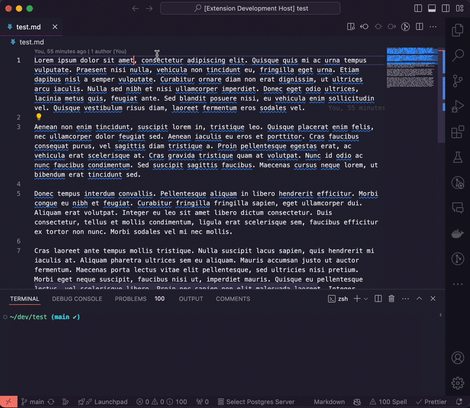

# GitHub File Linker

## Features

Quickly and easily select lines of a file in a GitHub repo and get a link to the same code on GitHub to share with others!

## Release Notes

Users appreciate release notes as you update your extension.

### 1.0.0

Initial release of GitHub File Linker
